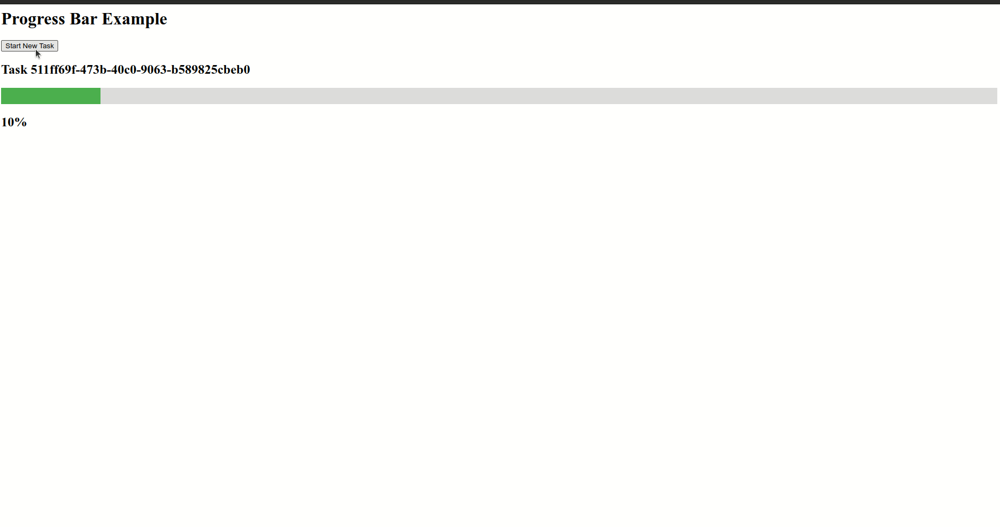

# Prueba practica:

### Tarea:

Escribe una vista en Django que maneje una tarea de larga duración de forma asíncrona utilizando Django Channels o Celery. Explica cómo asegurarías que la tarea se realice de manera asíncrona.

### Solución:



Para resolver la tarea creé un proyecto test_task. Puede ser lanzado con Docker:

```shell
cd test_task
docker-compose up --build
```

#### Contenido del proyecto:

##### Archivo views.py en test_task/progress_bar/:

La vista start_task (en views.py) comienza una tarea de Celery tras recibir una solicitud POST. 

La vista index carga la página principal donde el usuario puede iniciar la tarea. Además, con el código JS (progress_bar/static/progress_bar/progress.js) se abre WebSocket.

##### Archivo tasks.py en test_task/progress_bar/:

Aquí he definido la tarea de larga duración long_running_task. Esta tarea actualiza el progreso mediante WebSockets utilizando Django Channels.

Archivo consumers.py en test_task/progress_bar/:

Define un ProgressBarConsumer que maneja la comunicación WebSocket. Se suscribe a un grupo y envía actualizaciones de progreso a los clientes conectados.
